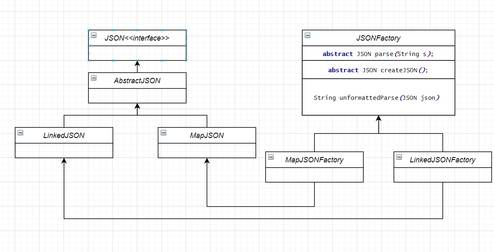
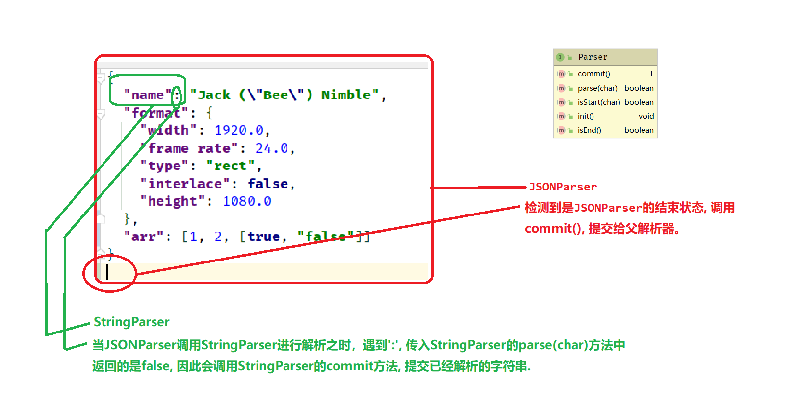

# JT-JSON

### ? 我的类结构

1. 采用**工厂方法模式**生产JSON对象, 抽象父工厂负责把JSON对象解析为字符串, 而子工厂
   可生产出基于多级双端链表的LinkedJSON对象或者基于`HashMap`的`MapJSON`
   
2. 解析器架构: 采用NFA有限自动机进行解析, 并且采用Parser接口分任务解析
   - 每个解析器都采用**NFA有限状态机**来书写, 每个解析器**各司其职**, 在`parse(char ch)`遇到错误的字符的时候会向父解析器返回false
      代表解析终末, 父解析器会根据情况调用本解析器的`commit()`方法, commit会检查当前解析器中的内容是否正确, 状态是否为终态,
      然后向父解析器返回相应内存中存储的值, 或者是抛出JSON异常。同时会调用`init()`方法, 以保证内存中的缓存值被清空, 并且状态为初态,
     方便下次解析。
   - 注意: 子解析器仅仅负责自己状态的改变, 以及缓存值的更新, 如下图例子, "name"后面不管是跟随着':'或是非法字符'@', 都只会向父解析器返回false
      因为判断':'或是非法字符'@'是父解析器的责任, 是父解析器状态改变的原因, 与子解析器无关, 父解析器只需写
     ```
     while(stringParser.parse(ch)) {
         // 一直停留在字符串解析状态
     }
     ```
     其他解析器亦是如此。
   - 因此我们可以着眼于细微之处, 从数字解析器开始, 然后写字符串解析器, 一步一步写, 最后完成整个JSON的解析
   